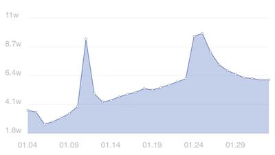
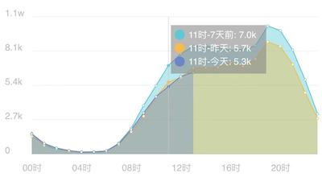

# 小程序图表组件
本组件库产生的原因有三个

 1. 小程序canvas与浏览器标准canvas并不相同，大部分已有的组件没法直接复用；
 2. 大部分开源图表组件都太过强大并且体积庞大，实际上并不需要太强的配置功能；
 3. 即便开源组件配置强大，也很难满足设计师；

故将业务中的一套图表组件开源出来，不会很强大，但是该有的配置基本都有，有问题可以提issue，我会尽量修。

## 组件列表

### 折线图组件

[点击查看文档](https://github.com/yuanzm/miniapp-charts/blob/master/doc/README.md)

效果图如下:

### 雷达图组件
[点击查看文档](https://github.com/yuanzm/miniapp-charts/blob/master/doc/radar.md)
效果图如下:

### 柱状图组件
文档：TODO

效果图如下:

### 分布图组件
文档：TODO

效果图如下:

